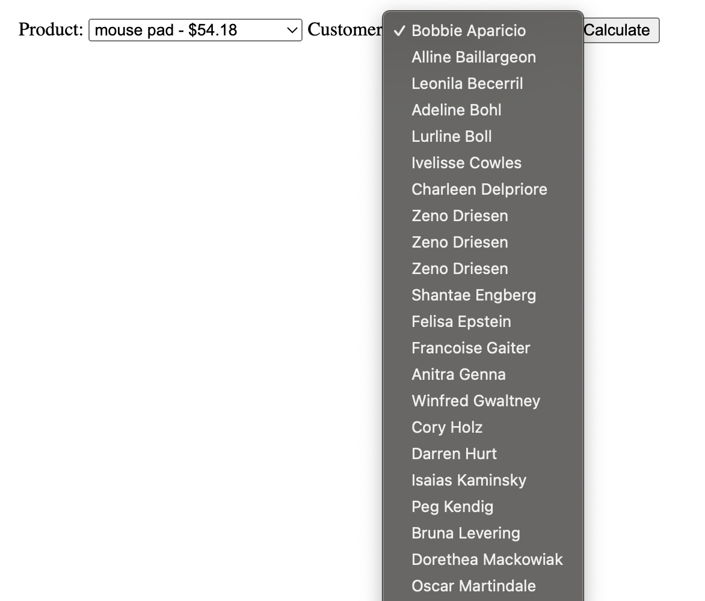

# Title: PHP Price Calculator challenge

- Team challenge : `pairs`

## Our learning objectives
- Apply basic OOP principles
- Import data with a database
- Learn to use an MVC

## The Mission
Today and in the next following few days Vlad and I are going to combine our newly required OOP powers with a database.
We will put our heads together and make this challenge our own.
The challenge will require read access and not write access, this is to give us some time to get familiar with databases.

Our price calculator needs the following entities:
- Customer (Firstname, Lastname)
- A customer group (Name)
- A product (product name, price in cents)

*Notice that the price is in cents stored as an integer, not as a float. This is because you should _never store currency as a float_. The reason for this is that they store the number with unexpected rounding behavior. For example, it will store 5 as 4.999999999999999999 (scientific fraction), making pennies appear and disappear, once you start to do calculations with multiple floats.*

*Don't forget to divide by 100 in your PHP code to show the pennies again!*

A customer belongs to a customer group, which can also belong to another group (infinite).
You don't need to worry for infinite loops in this exercise.

Both a customer and a group can have a discount, which can be a percentage or a fixed amount.

#### To calculate the price:
- For the customer group: In case of variable discounts look for highest discount of all the groups the user has.
- If some groups have fixed discounts, count them all up.
- Look which discount (fixed or variable) will give the customer the most value.
- Now look at the discount of the customer.
- In case both customer and customer group have a percentage, take the largest percentage.
- First subtract fixed amounts, then percentages!
- A price can never be negative.

### Importing the data
With this exercise you can find an [SQL file](resources/import.sql) you can import into a database, the previous exercise has shown you the command to do this.
If done successfully, will create 3 different tables (Customer, Group, Product) with some data inside it.

### What is an MVC?
MVC is a classic web design pattern consistent of three levels, and is an extension of the principle of **separation of concerns**:

- The **Controller** responds to user actions and invokes changes on the model or view as appropriate.
- The **Model** represents the information on which the application operates--its business logic.
- The **View** renders the model into a web page suitable for interaction with the user.

For now you should create 3 different directories:
- [x] **Controller/**: has access to GET/POST vars, receives the Request
- [x] **Model/**: Most of your code should be here, for example the Product and Customer class.
- [x] **View/**: Your HTML files.

While splitting up the Controller & Model is quite intuitive, splitting up the View from the Controller might require a larger change in how you write code. Let us look at some example:

````php
<?php
//oldcode.php
if($_GET['age'] > 18) {
    echo '<h1>You are an adult!</h1>';
} else {
    echo '<h1>You are a child!</h1>';
}
````
We can split this up into two files:
````php
<?php
//view.php
$sentence = ($_GET['age'] > 18) ? 'You are an adult!' : 'You are a child!';
require 'view.php';
````

````php
<!-- view.php-->
<h1><?php echo $sentence?></h1>
````

## Must-have features
- [x] A dropdown where you can select a Product and a Customer and you get the basic information of the product + the price.
- [x] Use a [MVC pattern](https://en.wikipedia.org/wiki/Model%E2%80%93view%E2%80%93controller). You can use the [MVC Boilerplate](https://github.com/becodeorg/php-mvc-boilerplate).
- [ ] Use separate objects for importing the entities with SQL, and for managing the entities.

## Nice to have features
- [ ] An actual login page for a customer
- [ ] A table where you can see in detail how the price is calculated
- [ ] The possibility to have different prices for different quantities (look, 1 EUR per item for 1, 0.9 EUR per item for 100, ...)
- [ ] A category page for the different products

### Discussion for friday
- Do you prefer procedural code or object oriented one? Why?
- What is the use of an MVC? Do you prefer another way of structuring your code?

## Step 1
### Research on MVC:
- The Model-View-Controller (MVC) is an architectural pattern that separates an application into three main logical components: the _**model**_, _**the view**_, and the _**controller**_. Each of these components are built to handle specific development aspects of an application.

#### Model
- The Model component corresponds to all the data-related logic that the user works with. This can represent either the data that is being transferred between the View and Controller components or any other business logic-related data. For example, a Customer object will retrieve the customer information from the database, manipulate it and update it data back to the database or use it to render data.

#### View
- The View component is used for all the UI logic of the application. For example, the Customer view will include all the UI components such as text boxes, dropdowns, etc. that the final user interacts with.

#### Controller
- Controllers act as an interface between Model and View components to process all the business logic and incoming requests, manipulate data using the Model component and interact with the Views to render the final output. For example, the Customer controller will handle all the interactions and inputs from the Customer View and update the database using the Customer Model. The same controller will be used to view the Customer data.

Reads:
- https://dev.to/kahawaiikailana/what-s-the-difference-between-mvc-and-oop-4m9k
- https://programmingdive.com/understanding-mvc-design-pattern-in-php/

## Step 2
Connecting to MySQL using PDO.
PD whut?! Google this stuff. PDO is a `Database Access Abstraction Layer`, an application programming interface which unifies the communication between a computer application and databases.
I also hear stuff about .env file, so let's read this [article](https://udoyhasan.medium.com/what-is-an-env-file-and-how-to-use-an-env-file-in-php-4e146358cca6) that some people in the class have shared on what it is and how to use it.
So I first followed this article to set up an env file.
Afterwards I read the [following](https://phpdelusions.net/pdo_examples/connect_to_mysql) on how to connect my database using PDO.

## Step 3
Here I first wanted to get some data from the database we got. So I created the following function in my Database Class:
 ```php
    public function getCustomers() : array{
        $sql = "SELECT id, firstname, lastname FROM customer ORDER BY lastname";
        $stmt = $this->connect()->query($sql);
        $result = $stmt->fetchAll();
        return $result;
    }
 ```
I then required the Model/Database in my index.php file, afterwards I created a new database connection in my HomepageController.
From here I was able to display the customers in a drop-down list. Afterwards I heard that the way I did it isn't very OOP. So I'll have to do this better in the future.
The following code helps me to get the information I need to display it in the view afterwards:
```php
class HomepageController
{
    private $databaseLoader;
    public function __construct() {
        $this->databaseLoader = new Database();
    }
    //render function with both $_GET and $_POST vars available if it would be needed.
    public function render(array $GET, array $POST)
    {
        $customerNames = $this->databaseLoader->getCustomers();
        $productNames = $this->databaseLoader->getProducts();
    ...
```
What my homepage.php looks like:
```php
<form method="post">
    <label for="products">Product:</label>
    <select id="products" name="products">
        <?php
            foreach ($productNames as $product){
                echo "<option value='" . $product['id'] . "'>" . $product['name']. " - $" . $product['price']."</option>";
            }
        ?>
    </select>
    <label for="customers">Customer:</label>
    <select id="customers" name="customers">
        <?php
        foreach ($customerNames as $customer){
            echo "<option value='" . $customer['id'] . "'>" . $customer['firstname'] . '&nbsp;' . $customer['lastname'] . "</option>";
            }
        ?>
    </select>
    <button type="submit" name="submit">Calculate</button>
</form>
```
This will give me the following view:


## Step 4
From here on out we struggled very hard. How to make all the calculations and to get everything together. Vlad had his javascript test and wasn't feeling too well throughout the assignment so we did our best to make it work.
So we talked to Sicco to give us a boost in which way we should be thinking. Because on monday we struggled the whole day and didn't manage to do anything.
We slept a night on it and the next day I first started to read some repositories of my fellow students. I don't really like doing this but since we were struggling it could help us.
Brian really managed to explain everything very well, so I looked on how he did the calculations. It was all very understandable. So thanks to his work we managed to do some calculations.
I personally felt like we needed a separate exercise in which we would just learn how to get data from a database and display it and afterwards do calculations. But by doing these things more and more, I feel confident it will go better with time.

I also learned that it isn't always easy to work with someone else then the people you are used to.

## Some TO-DO logic we got from Sicco
- [x] TODO explore what is MVC? Why is everything a class? Research!
- [x] TODO make a DataBase
- [x] TODO make connection between CONTROLLER/MODEL and DB
- [x] TODO display data to test connection
- [x] TODO DO IT ALL ON HOMEPAGE FOR TESTING REFACTOR LATER